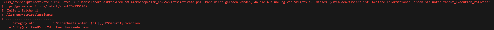

# LSM microscope hardware controller 

This github will include the necessary software to control the different components of the LSM setup

## Environment

In order to use the software it is recommended to crate a virtual environment (you need to install python beforehand :snake:). You can create the virtual environment running the next command `python -m venv lsm_env`.

To activate the environment, open a console in the path were you clone the repository and run the command `.\lsm_env\Scripts\activate` 

If the environment is properly activated you will see the name of the environment before the path in the command line (example bellow)

If you got this error, 

Run the command `Set-ExecutionPolicy -ExecutionPolicy Bypass -Scope Process -Force` and try to activate the environment again.

Once you are in the environment, you will need to install the required libraries. These libraries are in the requirements.txt file. You can install them running the command `pip install -r requirements.txt`. It can take some minutes, so grab a coffee in the meanwhile :coffee: :smile:

To deactivate the environment and return to the global Python environment, simply use the `deactivate` command.

<!-- ## Napari

[Napari](https://napari.org) is a powerful library for n-dimensional image visualisation, annotation, and analysis. Hence, it is the selected tool for this project. To run it, just write the command `napari` in the console after activating the environment. -->